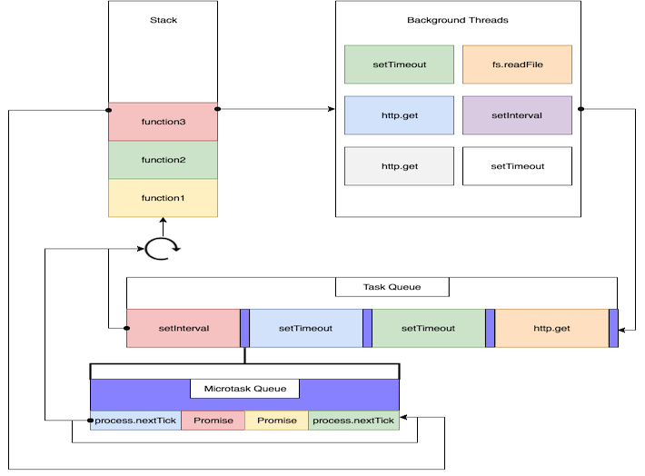

class: center, middle

# Random JS Tutorial - Part 1

Sync, Async

---

# Agenda

*  Event Queue

*  Callback vs Promise

*  Regenerator

*  Promise vs Async/Await

---

# Event Queue

Javascript is a single thread languange;

We can't put thread into `sleep` mode and block thread;

Event queue is the corner stone;

https://blog.risingstack.com/node-js-at-scale-understanding-node-js-event-loop/

---

# Event Queue -- diagram



---

# Callback

```javascript
function serverCall(onSuccess) {
    //making asynchronise call, ajax/timeout/etc.
    $.ajax('some-url', some-data, {
        success: onSuccess
    })
}
```

--

Hell !!😱😱😱
```javascript
function main() {
    createOrder(function(orderId){
        addProductsToOrder(orderId, products, function(transactionNumber){
            sendConfirmationEmail(transactionNumber, function(){
                andOthers(function() {
                    andOthers2(function(){
                        andOther3(function(){})
                    })
                })
            })
        })
    })
}
```

---

# Callback (better?) Hell 😅

```javascript
function main() {
    createOrder(addProductsToOrder)
}
function addProductsToOrder(orderId) {
    serverCall_AddProducts(orderId, products, sendConfirmation)
}
function sendConfirmation(transactionNumber) {
    serverCall_SendConfirmation(andOthers);
}
function andOthers() {}
function andOthers2() {}
function andOthers3() {}
```